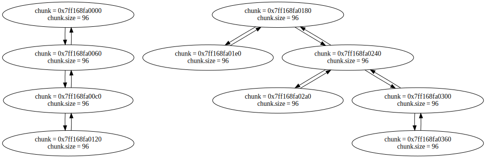

# mem++

[](https://codecov.io/gh/m4drat/memplusplus)


C++ memory allocator with smart features, such as garbage collection, and heap compacting.

## Current version

Curren library version: 2.3.5

## Features

- Garbage Collecting
- Fast memory allocations (using bump allocators techniques)
- Fast free algorithms
- Advanced compacting algorithms

## Supported systems / limitations

- All Unix-like systems (where it is possible to use mmap)
- g++ or clang++ compilers
- currently supports only single-threaded applications
- currently you cant use manual memory management and GarbageCollection simultaneously (e.g. you should only use smart pointers, or manually control memory using Allocate and Deallocate)

## Usage

1. Install latest build systems: `apt install cmake g++ clang`
2. Clone library sources: `git clone https://github.com/m4drat/memplusplus/`

### How to use the library as a dependency (external project)

1. run cmake from root directory (memplusplus):

    ```bash
    cmake \
        -S . \
        -B build \
        -DCMAKE_BUILD_TYPE=Release \
        -DMPP_BUILD_SHARED_LIBS=ON \
    ```

2. compile and install:

    ```bash
    sudo cmake \
        --build build \
        --target install \
        -j 8
    ```

3. After the library is installed, in your CMakeLists.txt use find_package, to actually use the library:

    ```cmake
    cmake_minimum_required(VERSION 3.13)
    project(<YOUR_PROJECT_NAME>)

    find_package(mpp 2.3.5 REQUIRED)

    add_executable(<YOUR_PROJECT_NAME> <YOUR_SOURCES>)
    target_link_libraries(<YOUR_PROJECT_NAME> PRIVATE mpp::mpp)
    ```

4. After that you will be able to include library headers in your sources like that: `#include <mpplib/mpp.hpp>`

### How to use the library internally

1. just copy whole directory with libmemplusplus to your project root directory.

2. In your project's cmake file add this:

    ```cmake
    add_subdirectory(libmemplusplus)
    target_link_libraries(<YOUR_PROJECT_NAME> PRIVATE lib::mpp)
    ```

3. After that you will be able to include library headers in your sources like that: `#include "mpplib/mpp.hpp"`

## Build options

Global options:

- `MPP_ENABLE_COVERAGE` - build with code coverage support

- `MPP_BUILD_FUZZER` - build fuzzer project (will build library with sanitizers)

- `MPP_BUILD_EXAMPLE` - build example project

- `MPP_BUILD_TESTS` - build tests

- `MPP_BUILD_DOCS` - build documentation

- __currently not supported__. `MPP_BUILD_BENCMARK` - build benchmarks

Library options:

- `MPP_BUILD_SHARED_LIBS` - build shared or static libraries

- __currently not supported__. `MPP_FULL_DEBUG` - build in full debug mode (adds extended security checks in debug build)

- __currently not supported__. `MPP_SECURE` - build in secure mode with additional security features

- `MPP_PROFILE` - enable profiling instrumentation

- `MPP_SANITIZERS` - add sanitizers to the build

- `MPP_COLOUR_DEBUG_OUTPUT` - Add colours to debug output

- `MPP_STATS` - Add statistics instrumentation.

## Environment options

- `MPP_DUMP_OBJECTS_GRAPH=1` - dump objects graph to file `objects.dot`, while performing `GC::Collect()` (only exists in debug mode)

- `MPP_SHOW_STATISTICS=1` - display statistics after program termination (should be built with `MPP_STATS` set to ON)

## Examples

- Manual memory managment

    ```c++
    #include <mpplib/mpp.hpp>

    ...

    // will call constructor automatically, like new
    Object* obj = mpp::MemoryAllocator::Allocate<Object>(<constructor params>);
    // create raw pointer (behaves like malloc)
    void* ptr = mpp::MemoryAllocator::Allocate(128);

    ...

    // will call destructor automatically, like delete
    mpp::MemoryAllocator::Deallocate(obj);
    // only deallocates raw pointer (behaves like free)
    mpp::MemoryAllocator::Deallocate(ptr);
    ```

- Automatic memory managment

    ```c++
    #include <mpplib/mpp.hpp>

    ...

    // create smart pointer, that will automatically deallocate object, when needed
    mpp::SharedGcPtr<Object> object = mpp::MakeSharedGcPtr<Object>(<constructor params>);

    ...

    // collect all garbage + compact memory (can be called manually)
    GC::GetInstance().Collect();
    ```

## Debugging / profiling library

Memplusplus provides different debug-like features, such as: data visualizers, profiler, statistics collector.

- Data visualizers:
  
  In Debug builds you are able to dump .dot representation of ChunkTreap and GcGraph (only using specific environment variable). Later you can "render" this .dot files using dot from graphviz.  

  - ChunkTreap visualizer

    How to dump ChunkTreap in code (don't forget to redirect program output to file treap.dot):

    ```c++
    // 1. Get the arena you want to dump the tree for
    Arena* tmpArena = MemoryAllocator::GetArenaList()[0]

    // 2. Extract ChunkTreap from this arena, and dump it
    // (in this example everything was dumped to std::cout).
    tmpArena->freedChunks.GenerateGraphvizLayout(std::cout);
    ```

    How to generage .svg file with treap:

    ```bash
    dot -Tsvg treap.dot -o treap.svg
    ```

    After that you will get .svg file with your tree:
    

  - GcGraph visualizer

    Visualization of GcGraph is much simplier. Just build library in Debug mode, and set MPP_DUMP_OBJECTS_GRAPH=1 before running target app. On each GC cycle it will dump objects graph to file "objects_cycle\<current cycle number\>.dot". Then just generate .svg file with dot.

    ```bash
    dot -Tsvg objects.dot -o objects.svg
    ```

    For example, for this code (it creates simple linked list and tree):

    ```c++
    // Linked List node
    struct Node {
        uint32_t data;
        SharedGcPtr<Node> prev;
        SharedGcPtr<Node> next;

        Node(uint32_t t_data, SharedGcPtr<Node> t_p, SharedGcPtr<Node> t_n)
            : data{t_data}, prev{t_p}, next{t_n}
        {
        }
    };

    // Create Linked List
    SharedGcPtr<Node> n1 = MakeSharedGcPtr<Node>(1, nullptr, nullptr);
    SharedGcPtr<Node> n2 = MakeSharedGcPtr<Node>(2, nullptr, nullptr);
    SharedGcPtr<Node> n3 = MakeSharedGcPtr<Node>(3, nullptr, nullptr);
    SharedGcPtr<Node> n4 = MakeSharedGcPtr<Node>(4, nullptr, nullptr);

    n1->prev = nullptr;
    n1->next = n2;

    n2->prev = n1;
    n2->next = n3;

    n3->prev = n2;
    n3->next = n4;

    n4->prev = n3;
    n4->next = nullptr;

    // Tree node
    struct TreeNode {
        uint32_t data;
        SharedGcPtr<TreeNode> left;
        SharedGcPtr<TreeNode> right;
        SharedGcPtr<TreeNode> up;

        TreeNode(uint32_t t_data, SharedGcPtr<TreeNode> t_left, SharedGcPtr<TreeNode> t_right, SharedGcPtr<TreeNode> t_up)
            : data{t_data}, left{t_left}, right{t_right}, up{t_up}
        {
        }
    };

    // Create Random tree
    SharedGcPtr<TreeNode> root = MakeSharedGcPtr<TreeNode>(0, nullptr, nullptr, nullptr);
    SharedGcPtr<TreeNode> treeNode1 = MakeSharedGcPtr<TreeNode>(1, nullptr, nullptr, nullptr);
    SharedGcPtr<TreeNode> treeNode2 = MakeSharedGcPtr<TreeNode>(2, nullptr, nullptr, nullptr);
    SharedGcPtr<TreeNode> treeNode3 = MakeSharedGcPtr<TreeNode>(3, nullptr, nullptr, nullptr);
    SharedGcPtr<TreeNode> treeNode4 = MakeSharedGcPtr<TreeNode>(4, nullptr, nullptr, nullptr);
    SharedGcPtr<TreeNode> treeNode5 = MakeSharedGcPtr<TreeNode>(5, nullptr, nullptr, nullptr);

    root->up = nullptr;
    root->left = treeNode1;
    root->right = treeNode2;

    treeNode1->up = root;
    treeNode1->left = nullptr;
    treeNode1->right = nullptr;

    treeNode2->up = root;
    treeNode2->left = treeNode3;
    treeNode2->right = treeNode4;

    treeNode3->up = treeNode2;
    treeNode3->left = nullptr;
    treeNode3->right = nullptr;

    treeNode4->up = treeNode2;
    treeNode4->left = treeNode5;
    treeNode4->right = nullptr;

    treeNode5->up = treeNode4;
    treeNode5->left = nullptr;
    treeNode5->right = nullptr;

    GC::GetInstance().Collect();
    ```

    You you will get this objects graph.
    

- Profiler

  123

- Statistics collector

  123

## Performance comparisons

## Documentation

- Install doxygen, sphinx, breathe

- Configure:

    ```bash
    cmake \
        -S . \
        -B build \
        -DCMAKE_BUILD_TYPE=Release \
        -DMPP_BUILD_FUZZER=OFF \
        -DMPP_BUILD_EXAMPLE=OFF \
        -DMPP_BUILD_TESTS=OFF \
        -DBUILD_SHARED_LIBS=OFF \
        -DMPP_BUILD_DOCS=ON
    ```

- Build docs:

    ```bash
    cmake \
        --build build \
        -j 8
    ```

- Now docs can be found in "./build/docs/doxygen/html" or "./build/docs/sphinx"

## Tests

- Configure tests:

    ```bash
    cmake \
        -S . \
        -B build \
        -DCMAKE_BUILD_TYPE=Release \
        -DBUILD_SHARED_LIBS=OFF \
        -DMPP_BUILD_TESTS=ON
    ```

- Build tests:

    ```bash
    cmake \
        --build build \
        --target unit_tests \
        -j 8
    ```

- Run tests:

    ```bash
    cd build && ctest
    ```

## clang-format and clang-tidy

- install clang-tidy and clang-format

- Configure:

    ```bash
    cmake \
        -S . \
        -B build \
        -DCMAKE_BUILD_TYPE=Release
    ```

- Use clang-format:

    ```bash
    cmake \
        --build build \
        --target clang-format
    ```

- Use clang-tidy:

    ```bash
    cmake \
        --build build \
        --target clang-tidy
    ```
