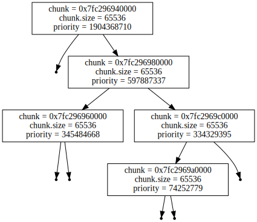

# mem++

[](https://codecov.io/gh/m4drat/memplusplus)


- [mem++](#mem)
  - [🔢 Current version](#-current-version)
  - [🔬 Features](#-features)
  - [⚠ Supported systems / limitations](#-supported-systems--limitations)
  - [❓ Usage](#-usage)
    - [How to use the library as a dependency (external project)](#how-to-use-the-library-as-a-dependency-external-project)
    - [How to use the library internally](#how-to-use-the-library-internally)
  - [📀 Build options](#-build-options)
  - [🔳 Environment options](#-environment-options)
  - [📚 Examples](#-examples)
  - [💻 Debugging/profiling library](#-debuggingprofiling-library)
  - [🔥 Heuristic layouting](#-heuristic-layouting)
    - [1. Find connected components](#1-find-connected-components)
    - [2. Layout each component heuristically](#2-layout-each-component-heuristically)
  - [🚀 Performance comparisons](#-performance-comparisons)
  - [🧾 Documentation](#-documentation)
  - [🧪 Tests](#-tests)
  - [🚁 clang-format and clang-tidy](#-clang-format-and-clang-tidy)

C++ memory allocator with smart features, such as garbage collection, and heap compacting.

## 🔢 Current version

Current library version: 0.3.5

## 🔬 Features

- Garbage Collecting
- Fast memory allocations (using bump allocators techniques)
- Fast free algorithms
- Advanced compacting algorithms, which are used to reduce memory fragmentation and improve cache locality: [heuristic-layouting](#-heuristic-layouting)

## ⚠ Supported systems / limitations

- The library is still in development, so it is not recommended to use it in production.
- All Unix-like systems (where it is possible to use `mmap`)
- g++ or clang++ compilers
- __Currently supports only single-threaded applications__
- Currently, you can't use manual memory management and GarbageCollection simultaneously (e.g. you should only use smart pointers, or manually control memory using Allocate and Deallocate)

## ❓ Usage

1. Install latest build systems: `apt install cmake g++ clang`
2. Clone just the library: `git clone https://github.com/m4drat/memplusplus/`
3. Clone the library (with tests support): `git clone --recurse-submodules=./libraries/googletest https://github.com/m4drat/memplusplus/`
4. If you want to run benchmarks, take a look at this: [link](#-performance-comparisons)

### How to use the library as a dependency (external project)

1. run cmake from the root directory (memplusplus):

    ```bash
    cmake \
        -S . \
        -B build \
        -DCMAKE_BUILD_TYPE=Release \
        -DMPP_BUILD_SHARED_LIBS=ON \
    ```

2. compile and install:

    ```bash
    sudo cmake \
        --build build \
        --target install \
        -j 8
    ```

3. After the library is installed, in your CMakeLists.txt use find_package, to actually use the library:

    ```cmake
    cmake_minimum_required(VERSION 3.13)
    project(<YOUR_PROJECT_NAME>)

    find_package(mpp 0.3.5 REQUIRED)

    add_executable(<YOUR_PROJECT_NAME> <YOUR_SOURCES>)
    target_link_libraries(<YOUR_PROJECT_NAME> PRIVATE mpp::mpp)
    ```

4. After that you will be able to include library headers in your sources like that: `#include <mpplib/mpp.hpp>`

### How to use the library internally

1. just copy the whole directory with libmemplusplus to your project root directory.

2. In your project's cmake file add this:

    ```cmake
    add_subdirectory(libmemplusplus)
    target_link_libraries(<YOUR_PROJECT_NAME> PRIVATE mpp::mpp)
    ```

3. After that you will be able to include library headers in your sources like that: `#include "mpplib/mpp.hpp"`

## 📀 Build options

Global options:

- `MPP_ENABLE_COVERAGE` - build with code coverage support
- `MPP_BUILD_FUZZER` - build fuzzer project (will build the library with sanitizers)
- `MPP_BUILD_EXAMPLE` - build example project
- `MPP_BUILD_TESTS` - build tests
- `MPP_BUILD_DOCS` - build documentation

Library options:

- `MPP_BUILD_SHARED_LIBS` - build shared or static libraries
- `MPP_FULL_DEBUG` - build in full debug mode (adds extended security checks in debug build)
- `MPP_SECURE` - build in secure mode with additional security features
- `MPP_PROFILE` - enable profiling instrumentation
- `MPP_SANITIZERS` - add sanitizers to the build
- `MPP_COLOUR_DEBUG_OUTPUT` - Add colors to debug output
- `MPP_STATS` - Add statistics instrumentation.
- `MPP_ENABLE_LOGGING` - Enable logging (even in release mode)

## 🔳 Environment options

- `MPP_DUMP_OBJECTS_GRAPH=1` / `MPP_DUMP_OBJECTS_GRAPH=2` - dump objects graph to file `objects.dot`, while performing `GC::Collect()` (only possible in debug mode)

- `MPP_SHOW_STATISTICS=1` - display statistics after program termination (should be built with `MPP_STATS` set to ON)

## 📚 Examples

- Automatic memory management

    ```c++
    #include <mpplib/mpp.hpp>

    ...

    // create smart pointer, that will automatically deallocate object, when needed
    mpp::MakeShared<Object> object = mpp::MakeShared<Object>(<constructor params>);

    // create array of Objects, that will be automatically deallocated, when goes out of scope
    mpp::MakeShared<Object[]> objects = mpp::MakeSharedN<Object>(<array size>, <constructor params>);

    ...

    // collect all garbage + compact memory (should be called manually)
    GC::GetInstance().Collect();
    ```

- ~~Manual memory management~~ - deprecated

    ```c++
    #include <mpplib/mpp.hpp>

    ...

    // will call constructor automatically, like new
    Object* obj = mpp::Allocate<Object>(<constructor params>);
    // create raw pointer (behaves like malloc)
    void* ptr = mpp::Allocate(128);

    ...

    // will call destructor automatically, like delete
    mpp::Deallocate(obj);
    // only deallocates raw pointer (behaves like free)
    mpp::Deallocate(ptr);
    ```

## 💻 Debugging/profiling library

Memplusplus provides different debug-like features, such as data visualizers, profilers, and statistics collectors.

- Backtrace functionality for MPP_ASSERT:

    Add these flags to your project's CMakeLists.txt, if you want to see a backtrace when `MPP_ASSERT` fails:

    ```cmake
    # For GCC
    target_compile_options(${PROJECT_NAME} PRIVATE -g -O0)
    target_link_libraries(${PROJECT_NAME} PRIVATE mpp::mpp -export-dynamic)

    # For Clang
    target_compile_options(${PROJECT_NAME} PRIVATE -g -O0)
    target_link_libraries(${PROJECT_NAME} PRIVATE mpp::mpp -Wl,--export-dynamic)
    ```

- Address Sanitizer support (ASAN):

    Enable `MPP_SANITIZERS` before building the library. Then compile your project with `-fsanitize=address` flag. As a result, you will get asan-compatible build which will help you to debug any memory management issues.

    Example buggy code:

    ```c++
    void* p1 = MM::Allocate(128);
    MM::Deallocate(p1);
    *(uint32_t*)p1 = 0x13371337; // Use-after-free write
    ```

    Example ASAN report for this code:

    ```c++
    =================================================================
    ==26738==ERROR: AddressSanitizer: use-after-poison on address 0x19b297400010 at pc 0x557f3c1aaea3 bp 0x7ffcb838c440 sp 0x7ffcb838c438
    WRITE of size 4 at 0x19b297400010 thread T0
        #0 0x557f3c1aaea2 in main /home/madrat/memplusplus/build/../example_project/src/main.cpp:137:20
        #1 0x7f16c401a0b2 in __libc_start_main /build/glibc-eX1tMB/glibc-2.31/csu/../csu/libc-start.c:308:16
        #2 0x557f3c0e7d2d in _start (/home/madrat/memplusplus/build/example_project/example_project-d+0x45d2d) (BuildId: cca1c1f77a22aeae021502831561465b63cc9f19)

    Address 0x19b297400010 is a wild pointer inside of access range of size 0x000000000004.
    SUMMARY: AddressSanitizer: use-after-poison /home/madrat/memplusplus/build/../example_project/src/main.cpp:137:20 in main
    
    ......
    ```

- Data visualizers:
  
    In Debug builds, you can dump .dot representation of the ChunkTreap and GcGraph (only using specific environment variable). Later you can render these .dot files using dot from graphviz.

    __ChunkTreap visualizer__

    How to dump ChunkTreap in code (don't forget to redirect program output to file treap.dot):

    ```c++
    // 1. Get the arena you want to dump the tree for
    Arena* tmpArena = MemoryAllocator::GetArenaList()[0]

    // 2. Extract ChunkTreap from this arena, and dump it
    // (in this example everything was dumped to std::cout).
    tmpArena->freedChunks.GenerateGraphvizLayout(std::cout);
    ```

    How to generate an .svg file with dot:

    ```bash
    dot -Tsvg treap.dot -o treap.svg
    ```

    After that you will get .svg file with your freed chunks treap:  
    

    __GcGraph visualizer__

    To visualization the GcGraph you have to:
    1. Build the library in debug mode, and set `MPP_DUMP_OBJECTS_GRAPH=1` (basic visualization) or `MPP_DUMP_OBJECTS_GRAPH=2` (advanced visualization) before running the target app. On each GC cycle, it will dump the objects graph to file "objects_cycle\<current cycle number\>.dot".
    2. Then generate an .svg file using dot as follows:

        ```bash
        dot -Tsvg objects_cycle<N>.dot -o objects_cycle<N>.svg
        ```

    For example, for this code (it creates a linked list and tree):

    ```c++
    // Linked List node
    struct Node {
        uint32_t data;
        SharedGcPtr<Node> prev;
        SharedGcPtr<Node> next;

        Node(uint32_t t_data, SharedGcPtr<Node> t_p, SharedGcPtr<Node> t_n)
            : data{t_data}, prev{t_p}, next{t_n}
        {
        }
    };

    // Create Linked List
    SharedGcPtr<Node> n1 = MakeShared<Node>(1, nullptr, nullptr);
    SharedGcPtr<Node> n2 = MakeShared<Node>(2, nullptr, nullptr);
    SharedGcPtr<Node> n3 = MakeShared<Node>(3, nullptr, nullptr);
    SharedGcPtr<Node> n4 = MakeShared<Node>(4, nullptr, nullptr);

    n1->prev = nullptr;
    n1->next = n2;

    n2->prev = n1;
    n2->next = n3;

    n3->prev = n2;
    n3->next = n4;

    n4->prev = n3;
    n4->next = nullptr;

    // Tree node
    struct TreeNode {
        uint32_t data;
        SharedGcPtr<TreeNode> left;
        SharedGcPtr<TreeNode> right;
        SharedGcPtr<TreeNode> up;

        TreeNode(uint32_t t_data, SharedGcPtr<TreeNode> t_left, SharedGcPtr<TreeNode> t_right, SharedGcPtr<TreeNode> t_up)
            : data{t_data}, left{t_left}, right{t_right}, up{t_up}
        {
        }
    };

    // Create a random tree
    SharedGcPtr<TreeNode> root = MakeShared<TreeNode>(0, nullptr, nullptr, nullptr);
    SharedGcPtr<TreeNode> treeNode1 = MakeShared<TreeNode>(1, nullptr, nullptr, nullptr);
    SharedGcPtr<TreeNode> treeNode2 = MakeShared<TreeNode>(2, nullptr, nullptr, nullptr);
    SharedGcPtr<TreeNode> treeNode3 = MakeShared<TreeNode>(3, nullptr, nullptr, nullptr);
    SharedGcPtr<TreeNode> treeNode4 = MakeShared<TreeNode>(4, nullptr, nullptr, nullptr);
    SharedGcPtr<TreeNode> treeNode5 = MakeShared<TreeNode>(5, nullptr, nullptr, nullptr);

    root->up = nullptr;
    root->left = treeNode1;
    root->right = treeNode2;

    treeNode1->up = root;
    treeNode1->left = nullptr;
    treeNode1->right = nullptr;

    treeNode2->up = root;
    treeNode2->left = treeNode3;
    treeNode2->right = treeNode4;

    treeNode3->up = treeNode2;
    treeNode3->left = nullptr;
    treeNode3->right = nullptr;

    treeNode4->up = treeNode2;
    treeNode4->left = treeNode5;
    treeNode4->right = nullptr;

    treeNode5->up = treeNode4;
    treeNode5->left = nullptr;
    treeNode5->right = nullptr;

    GC::GetInstance().Collect();
    ```

    Executing this code with `MPP_DUMP_OBJECTS_GRAPH=1` will generate this graph:
    

    Executing this code with `MPP_DUMP_OBJECTS_GRAPH=2` will generate this graph:
    

- Profiler

    Using the compilation flag `MPP_PROFILE`, you can build the library with the profiler enabled. To do so:
    1. Set the `MPP_PROFILE` before building the library
    2. Run the application until it exits
    3. In your current directory, find the file called __mpplib-profiling.json__
    4. Open this file using the chrome tracing tool. To do so, open chrome and navigate to the `chrome://tracing` page.

    Example output:

    

- Statistics collector

    This feature allows you to dump memory allocator statistics. To build the library with this feature, add `MPP_STATS` while building the project. You can use this feature in 2 ways:

    __In runtime using c++ API:__

    Example code to dump statistics:

    ```c++
    utils::Statistics::GetInstance().DumpStats(std::cout, true, false, false) << std::endl;
    ```

    Example output:

    ```none
    +============= STATISTICS DUMP START =============+
    MPP: MIN_CHUNK_SIZE     : 32 bytes
    MPP: CHUNK_HEADER_SIZE  : 16 bytes
    MPP: DEFAULT_ARENA_SIZE : 32.000 MB
    MPP: PAGE_SIZE          : 4.000 KB
    ~~~~~~~~~~~~~~~~ All active arenas ~~~~~~~~~~~~~~~~
    -------------- Arena: 0x1ffaf50 --------------
    MPP - Total arena size           : 32.000 MB
    MPP - Currently Allocated Space  : 960.000 Bytes
    MPP - Amount of free memory      : 31.999 MB (99.9971% of total arena size)
    MPP - Amount of allocated memory : 960.000 Bytes (0.0029% of total arena size)
    MPP - Allocated memory == 0      : false
    MPP - Memory used for metadata   : 160.000 Bytes (16.6667% of currently allocated space)
    MPP - TopChunk                   : [0x7f329dd803c0](96, 33553472|InUse:1|PrevInUse:1)
    MPP - Arena begin pointer        : 0x7f329dd80000
    MPP - Arena end pointer          : 0x7f329fd80000
    MPP - Freed chunks nodes (0)
    MPP - Chunks in use (10)

    ~~~~~~~~~~~~~~~~~~ General stats ~~~~~~~~~~~~~~~~~~
    -----------------  Arena: 1  -----------------
    MPP - Total amount of allocated memory inside arena : 960.000 Bytes
    MPP - Total amount of freed memory inside arena     : 0 bytes
    MPP - total freed == total allocated                : false
    MPP - Biggest allocation size                       : 96.000 Bytes
    MPP - Smallest allocation size                      : 96.000 Bytes
    MPP - Full size of arena                            : 32.000 MB
    MPP - Arena was allocated for big chunk             : false
    MPP - Arena was allocated by GC                     : false

    -----------------  Arena: 2  -----------------
    MPP - Total amount of allocated memory inside arena : 960.000 Bytes
    MPP - Total amount of freed memory inside arena     : 0 bytes
    MPP - total freed == total allocated                : false
    MPP - Biggest allocation size                       : "No allocations have been made yet"
    MPP - Smallest allocation size                      : "No allocations have been made yet"
    MPP - Full size of arena                            : 32.000 MB
    MPP - Arena was allocated for big chunk             : false
    MPP - Arena was allocated by GC                     : true

    ~~~~~~~~~~~~~ Garbage Collector stats ~~~~~~~~~~~~~
    -----------------  Cycle: 1  -----------------
    GC - Time wasted inside   GC::Collect() : 2.0000 ms
    GC - Memory cleaned after GC::Collect() : 0 bytes
    GC - Total size of active objects       : 960.000 Bytes

    +============== STATISTICS DUMP END ==============+
    ```

    __After program termination__, setting environment variable `MPP_SHOW_STATISTICS=1`. Important note. Runtime stats cannot be dumped using this approach.

    Example output:

    ```none
    +============= STATISTICS DUMP START =============+
    MPP: MIN_CHUNK_SIZE     : 32 bytes
    MPP: CHUNK_HEADER_SIZE  : 16 bytes
    MPP: DEFAULT_ARENA_SIZE : 32.000 MB
    MPP: PAGE_SIZE          : 4.000 KB
    ~~~~~~~~~~~~~~~~~~ General stats ~~~~~~~~~~~~~~~~~~
    -----------------  Arena: 1  -----------------
    MPP - Total amount of allocated memory inside arena : 960.000 Bytes
    MPP - Total amount of freed memory inside arena     : 0 bytes
    MPP - total freed == total allocated                : false
    MPP - Biggest allocation size                       : 96.000 Bytes
    MPP - Smallest allocation size                      : 96.000 Bytes
    MPP - Full size of arena                            : 32.000 MB
    MPP - Arena was allocated for big chunk             : false
    MPP - Arena was allocated by GC                     : false

    -----------------  Arena: 2  -----------------
    MPP - Total amount of allocated memory inside arena : 960.000 Bytes
    MPP - Total amount of freed memory inside arena     : 0 bytes
    MPP - total freed == total allocated                : false
    MPP - Biggest allocation size                       : "No allocations have been made yet"
    MPP - Smallest allocation size                      : "No allocations have been made yet"
    MPP - Full size of arena                            : 32.000 MB
    MPP - Arena was allocated for big chunk             : false
    MPP - Arena was allocated by GC                     : true

    ~~~~~~~~~~~~~ Garbage Collector stats ~~~~~~~~~~~~~
    -----------------  Cycle: 1  -----------------
    GC - Time wasted inside   GC::Collect() : 2 ms
    GC - Memory cleaned after GC::Collect() : 0 bytes
    GC - Total size of active objects       : 960.000 Bytes

    +============== STATISTICS DUMP END ==============+
    ```

- Allocate/Deallocate hooks

    This feature allows you to install your hooks on Allocate and Deallocate. Example:

    ```c++
    // Lambda as an Allocate hook. Important, all hooks should be static!
    static std::function<void*(std::size_t)> allocHook = [&](std::size_t t_AllocSize) {
        mpp::MemoryManager::SetAllocateHook(nullptr);
        void* ptr = mpp::MemoryManager::Allocate(t_AllocSize);
        mpp::MemoryManager::SetAllocateHook(allocHook);
        std::cout << "[mpp] Allocate(" << t_AllocSize << ") -> ";
        mpp::Chunk::DumpChunk(std::cout, mpp::Chunk::GetHeaderPtr(ptr)) << std::endl;
        return ptr;
    };
    // Set actual Allocate hook.
    mpp::MemoryManager::SetAllocateHook(allocHook);

    // Lambda as an Deallocate hook. Important, all hooks should be static!
    static std::function<bool(void*)> deallocHook = [&](void* t_Addr) {
        mpp::MemoryManager::SetDeallocateHook(nullptr);
        bool res = mpp::MemoryManager::Deallocate(t_Addr);
        mpp::MemoryManager::SetDeallocateHook(deallocHook);
        std::cout << "[mpp] Deallocate(" << t_Addr << ") -> " << res << std::endl;
        return res;
    };
    // Set actual Deallocate hook.
    mpp::MemoryManager::SetDeallocateHook(deallocHook);
    ```

## 🔥 Heuristic layouting

Right now algorithm consists of 2 parts:

### 1. Find connected components

Divide the graph of all objects into connected components. Each component is a set of objects that are reachable from each other. By dividing the graph into components we can solve the layout problem for each component separately, and what is more important, we can do it in parallel. Also, this step can be called optimal layout in some sense, because it is guaranteed that all objects in the component will be located in the same arena (contiguous memory block).

### 2. Layout each component heuristically

The next step is to layout objects from components in a way that allows you to access them in a cache-friendly way. This is achieved by using a heuristic layout algorithm. Currently, it's a proof of concept that works only for objects that have a single pointer field (to be precise, it should work for any data structure, that can be represented as a singly liked list). The algorithm is based on the following assumptions:

- If we have a singly linked list, then most likely the next element should be located right after the current one. If it is not (take a look at the image below), then it's a good idea to move it there. By doing so we can reduce cache misses and improve performance.


Benchmark results for the algorithm are presented here: [Benchmark results](#-performance-comparisons).

We can see that the algorithm is able to improve memory access time by 4-8 times (depending on the size of the list). Of course, it should be noted that the benchmark shows the corner case when the list is fully randomized in memory. In real life, the list might be layouted in a way that is already cache-friendly, so the algorithm will not be able to improve the performance.

Closing words. The algorithm is definitely not perfect, but it's a good start. It can be improved in many ways, for example, by adding more heuristics. Also, it can be used as a base for a more complex layouting algorithm, that will be able to layout any data structure.

## 🚀 Performance comparisons

1. Standalone benchmarks: [memplusplus-benchmarks](https://github.com/m4drat/memplusplus-benchmarks).
2. Continuous benchmarking results: [continuous-benchmarking](https://m4drat.github.io/memplusplus/dev/bench/)

## 🧾 Documentation

- Install doxygen, sphinx, breathe

- Configure:

    ```bash
    cmake \
        -S . \
        -B build \
        -DCMAKE_BUILD_TYPE=Release \
        -DMPP_BUILD_FUZZER=OFF \
        -DMPP_BUILD_EXAMPLE=OFF \
        -DMPP_BUILD_TESTS=OFF \
        -DBUILD_SHARED_LIBS=OFF \
        -DMPP_BUILD_DOCS=ON
    ```

- Build docs:

    ```bash
    cmake \
        --build build \
        -j 8
    ```

- Now docs can be found in "./build/docs/doxygen/html" or "./build/docs/sphinx"

## 🧪 Tests

- Configure tests:

    ```bash
    cmake \
        -S . \
        -B build \
        -DCMAKE_BUILD_TYPE=Release \
        -DBUILD_SHARED_LIBS=OFF \
        -DMPP_BUILD_TESTS=ON
    ```

- Build tests:

    ```bash
    cmake \
        --build build \
        --target unit_tests \
        -j 8
    ```

- Run tests:

    ```bash
    cd build && ctest
    ```

    Some tests are disabled because they require you to turn off ASLR (for example `GcGraphTest.GenerateGraphvizLayout`). This is considered unreliable, but if you still want to run them, you can do it like this:

    ```bash
    cd build && setarch `uname -m` -R ./build/tests/unit_tests --gtest_also_run_disabled_tests
    ```

## 🚁 clang-format and clang-tidy

- install clang-tidy and clang-format

- Configure:

    ```bash
    cmake \
        -S . \
        -B build \
        -DCMAKE_BUILD_TYPE=Release
    ```

- Use clang-format:

    ```bash
    cmake \
        --build build \
        --target clang-format
    ```

- Use clang-tidy:

    ```bash
    cmake \
        --build build \
        --target clang-tidy
    ```
